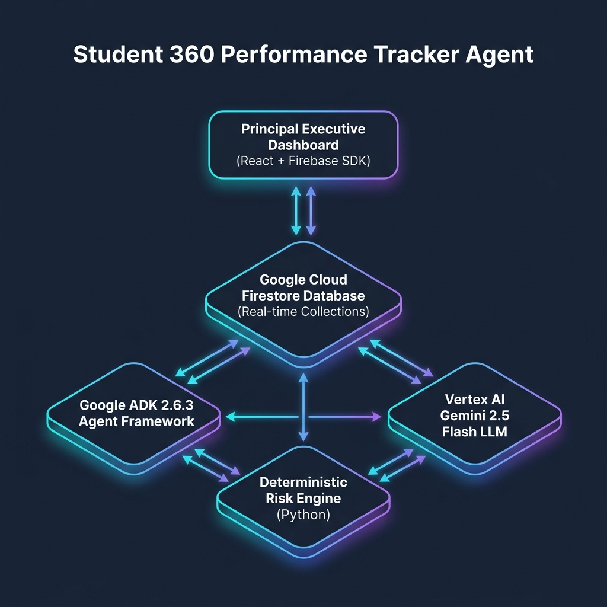
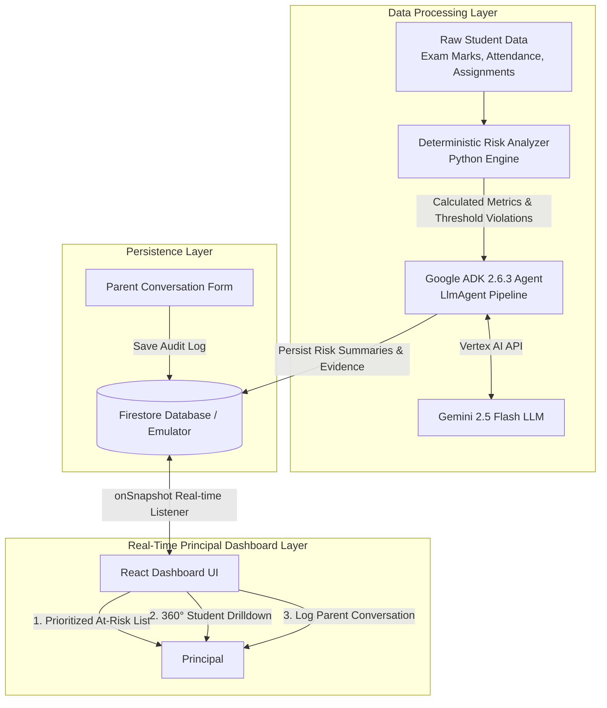

# Student 360 Performance Tracker Agent - System Architecture



## System Flow Diagram



### Text Flow Architecture

```text
Principal
   ↓
React Dashboard (Vite + Firebase Web SDK)
   ↓ (onSnapshot Real-Time Listener)
Firestore Database (students, risk_assessments, parent_conversations)
   ↑ (Persist Assessment Results)
Python / Google ADK Agent Pipeline
   ├── 1. Deterministic Risk Analyzer (academic decline, attendance %, submission compliance)
   ├── 2. Prompt Formatter (prompts.py)
   └── 3. Vertex AI Gemini 2.5 Flash (Generates plain-English summary & recommended action)
```

---

## Component Breakdown

### 1. Deterministic Risk Engine (`backend/agent/risk_analyzer.py`)
- Responsible for all raw mathematical calculations.
- Evaluates first score vs latest score percentage drop across subject exam series.
- Flags academic decline if decline >= 12% or latest score < 55/100.
- Flags attendance risk (<80% High, <85% Medium).
- Flags assignment submission discipline risk (<80% High, <88% Medium).
- Assigns composite priority score (`0 - 100`) to rank students automatically on the principal's dashboard.

### 2. Google ADK 2.6.3 Agent Pipeline (`backend/agent/agent.py`)
- Uses `google.adk.agents.LlmAgent` and `google.genai.Client(vertexai=True)`.
- Fuses calculated mathematical evidence into `STUDENT_RISK_EXPLANATION_PROMPT`.
- Executes Gemini 2.5 Flash to convert structured evidence into supportive, parent-friendly summaries and practical action plans.

### 3. Firestore Real-Time Persistence (`backend/firestore_service.py`)
- Collections:
  - `students`: raw student profiles & historical exam scores.
  - `risk_assessments`: evidence, AI summaries, composite scores, and recommendations.
  - `parent_conversations`: timestamped audit trail of discussions, agreements, and follow-up dates.

### 4. Principal React Dashboard (`frontend/src/App.jsx`)
- Uses `onSnapshot` subscriptions to render instant, real-time UI updates without polling.
- Highlights high-risk students in red at top of prioritized table.
- Drill-down modal renders 360° metrics, subject score charts, AI risk reasons, and a parent conversation audit logging form.
